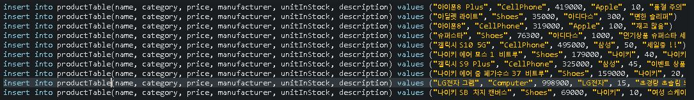

# 웹프레임워크(B)  - 김남윤 교수님
# #3 Homework
- __1591070 조재원__
 

---
## pom.xml
 
__14주차 강의때 실습한 Spring Boot를 기반으로 pom.xml을 작성했습니다.__ 
__문제 조건에 맞추어 Security 기능은 사용하지 않기에 포함하지 않았습니다.__
 
    
 

---
## logback.xml
 
__앞서 배웠던 log에 대한 것을 간단히 logging 하였습니다.__
 
    
 

---
## application.properties
 
- __데이터베이스 설정시 localhost:3306/helloproductdb-1591070 으로 설정하였습니다.__ 

- __Product.java를 Table로 생성할 때 문제 조건에서 테이블명을 productTable로 생성하라 하셨는데__ 
__T라는 대문자가 데이터 베이스로 매핑 할 때 언더바( \_ )로 치환되어 버립니다.__ 
__hibernate.naming.physical-strategy 설정을 추가하여 문제를 해결했습니다.__ 

- __initialization-mode=always 로 설정하여 프로젝트 실행시 항상 data.sql의 sql이 실행되도록 하였습니다.__ 

- __management.endpoints.web.exposure.include=* 을 사용한 이유는 spring boot의 actuator를 사용하여__ 
__localhost:9090/actuator/mappings 를 실행하기 때문입니다.__
 
    
 

---
## data.sql
 
 
    
 

---
## Product.java
 
__어노테이션을 이용하여 class product 를 데이터베이스에 매핑하였습니다.__ 
__JPA를 사용하여 데이터베이스의 데이터에 접근시 옳바른 데이터를 판단하기 위해 serialVersionUID를 추가합니다.__ 
### 테이블 구조
  
 
    
 

---
## ProductRepository.java
 
__Dao라는 용어를 사용하지 않고 Repository라고 사용하며, Dao의 역할을 수행합니다.__ 
__CrudRepository interface를 상속받고, 기본적으로 save saveAll findById findAll existsById delete 등__ 
__다양한 메소드들을 제공하지만, 추가적으로 category를 기준으로 검색하기 위해 findByCategory라는 메소드를 추가했습니다.__ 
__메소드 선언만 했을 뿐인데, 자동적으로 Spring이 메소드를 생성해 줍니다.__
 
    
 

---
## ProductController.java
 
- ### Request( Get ) /api/v1/products 으로 요청시 repository에서   모든 product를 꺼내어 JSON형식의 데이터로 응답합니다. 
- ### Request( Get ) /api/v1/products/{id} 로 요청시 repository에서   특정 id의 product를 꺼내어 JSON형식의 데이터로 응답합니다.
 

 
- ### Request( Post ) /api/v1/products/{id} 와 body에 데이터의 정보를 JSON형식으로 작성하여 요청하면, 새로운 product를 repository를 사용하여 데이터베이스에 생성합니다.
- ### Request( Delete ) /api/v1/products/{id} 으로 요청시 데이터베이스에서 id와 일치하는 product를 제거합니다. 

 

- ### Request( Put ) /api/v1/products/{id} 와 body에 데이터의 정보를 JSON형식으로 작성하여 요청하면 id가 일치하는 product 항목의 내용을 body로 넘어온 JSON 데이터 정보로 수정(update)합니다.
- ### Request( Get ) /api/v1/products/category/{category} 로 요청시 데이터베이스에서 category가 일치하는 product 리스트를 JSON형식의 데이터로 응답합니다.
 
    
 

---
## Postman을 이용한 요청, 응답
#### 위의 코드 순서에 맞게 작성하였습니다.
 
- #### __Get - localhost:9090/api/v1/products__ 
- #### __모든 데이터를 한 눈에 보기 힘들어 raw로 보기 선택했습니다.__
 
    
 

---
 
- #### __Get - localhost:9090/api/v1/products/2__ 
- #### __id(= 2번)로 특정 product의 정보 요청.__
 
    
 

---
 
- #### __Post - localhost:9090/api/v1/products__ 
- #### __요청시 Product의 정보를 JSON형태로 Body에 담아 요청 -> Body 데이터를 데이터베이스에 생성.__
 
    
 

---
 
- #### __Delete - localhost:9090/api/v1/products/11__ 
- #### __id(= 11번)의 정보를 삭제 요청 -> 정상적으로 삭제되어 삭제시 등록했던 status인 No Content 반환.__
 
    
 

---
 
- #### __Put - localhost:9090/api/v1/products/11__ 
- #### __id(= 11번)가 일치하는 product를 수정하기 위해 Body에 JSON형식의 데이터를 담아서 요청__
 
    
 

---
 
- #### __Get - localhost:9090/api/v1/products/category/cellphone__ 
- #### __category(= cellphone)가 일치하는 product 모두를 JSON형식의 데이터로 응답.__
 
    

---
## Spring Boot의 actuator 활용하여 Product REST API의 URL Mapping 정보 확인
  

 
- #### __url : localhost:9090/actuator/mappings__ 
- #### __mappings의 모든 정보 출력 화면입니다.__
 
    

---
## mappings에서 프로젝트에 추가한 Controller 부분입니다.
 

 
- ### __getAllProducts() and updateProduct()__
 
    

---
 
- ### __deleteProduct() and getProductById()__
 
    

---
 
- ### __findByCategory() and postProduct()__
 

---
# 감사합니다.

